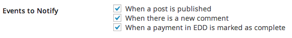
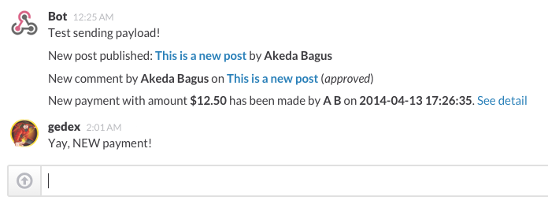

<!-- DO NOT EDIT THIS FILE; it is auto-generated from readme.txt -->
# Slack EDD

Send notifications to Slack channels whenever sales, in EDD, are made.

**Contributors:** [akeda](http://profiles.wordpress.org/akeda)  
**Tags:** [slack](http://wordpress.org/plugins/tags/slack), [api](http://wordpress.org/plugins/tags/api), [chat](http://wordpress.org/plugins/tags/chat), [notification](http://wordpress.org/plugins/tags/notification), [edd](http://wordpress.org/plugins/tags/edd), [downloads](http://wordpress.org/plugins/tags/downloads), [sales](http://wordpress.org/plugins/tags/sales)  
**Requires at least:** 3.6  
**Tested up to:** 3.8.1  
**Stable tag:** trunk (master)  
**License:** [GPLv2 or later](http://www.gnu.org/licenses/gpl-2.0.html)  
**Donate link:** http://goo.gl/DELyuR  

## Description ##

This plugin is an extension to [Slack plugin](http://wordpress.org/plugins/slack) that allows you to send notifications to Slack channels whenever sales are made.

The new event will be shown on integration setting with text **When a payment in EDD is marked as complete**. If checked then notification will be delivered once sales are made.

You can alter the message with `slack_edd_complete_purchase_message` filter. The filter receives following parameters (ordered by position):

* `$message` &mdash; Default string of message to be delivered
* `$payment_id` &mdash; Payment ID
* `$total` &mdash; Total in `float`
* `$formatted_price` &mdash; Nicely formatted price based on your EDD setting
* `$payment_meta` &mdash; Payment information
* `$user_info` &mdash; User whom made the purchase
* `$cart_items` &mdash; List of purchased downloads
* `$payment_url` &mdash; Admin URL for this payment

**Development of this plugin is done on [GitHub](https://github.com/gedex/wp-slack-edd). Pull requests are always welcome**.

## Installation ##

1. You need to install and activate [Slack plugin](http://wordpress.org/plugins/slack) first.
1. Then upload **Slack EDD** plugin to your blog's `wp-content/plugins/` directory and activate.
1. You will see new event with text **When a payment in EDD is marked as complete** in integration setting.

## Screenshots ##

### Event option in integration setting

### Your channel get notified whenever sales are made.

## Changelog ##

### 0.1.0 ###
Initial release

